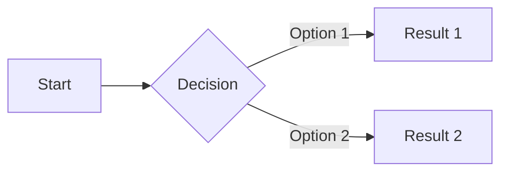

# Blog Writing Tone Guide

## Style Elements
- Use UK English spellings and grammar.
- Use clear, direct language and avoid complex terminology.
- Aim for a Flesch reading score of 80 or higher.
- Use the active voice.
- Avoid adverbs.
- Avoid buzzwords and instead use plain English.
- Use jargon where relevant but always explain it clearly.
- Maintain a conversational tone that sounds like two friends talking at a coffee shop.
- Format content in Markdown.
- Use contractions (don't, won't, can't, etc.) to maintain a conversational flow.
- Use first-person singular pronouns (I, my, me) rather than plural.
- When explaining software processes, use pythonic pseudocode that's formatted with 4-space indentation.
- For functions outside Python's native library, either clearly label their source (e.g., math.sqrt()) or create self-explanatory function names (e.g., calculate_network_latency()).

## Emotional Tone
- Avoid being salesy or overly enthusiastic.
- Express calm confidence to establish expertise.
- Be informative without being pedantic.
- Maintain a friendly, approachable voice.
- Use analogies and metaphors to explain complex concepts.

## Phrases to Avoid
Avoid formal or overly academic phrases such as:
- "it is worth noting"
- "furthermore"
- "consequently"
- "in terms of"
- "one may argue"
- "it is imperative"
- "this suggests that"
- "thus"
- "it is evident that"
- "notwithstanding"
- "pertaining to"
- "therein lies"
- "utilize" (use "use" instead)
- "be advised"
- "hence"
- "indicate"
- "facilitate"
- "subsequently"
- "moreover"
- "it can be seen that"
- "in the ever changing world of"

## Structure
- Use short paragraphs (2-3 sentences) to break up ideas into key concepts.
- Include subheadings to break up text.
- Avoid overusing bullet points - use paragraphs to explain concepts.
- Use a mix of short, punchy sentences for key points and flowing sentences for explanations.
- Include Mermaid diagrams to visualize concepts where appropriate.
- Support claims with specific data and statistics whenever possible.

## Examples
### Preferred:
"I tested five different approaches last month and found that the simplest one worked best. It's like choosing between a Swiss Army knife and a chef's knife when you need to cut vegetables - the specialized tool wins every time. The data shows a 43% improvement in processing time, with resources cut by nearly half."

### Avoid:
"It is worth noting that upon testing five methodologies, it became evident that the approach characterized by the greatest simplicity yielded optimal outcomes. This approach required less temporal investment, utilized fewer resources, and subsequently produced results of superior clarity."

### Mermaid Diagram Example:


### Pythonic Pseudocode Example:
```python
def optimize_network_traffic(traffic_data, optimization_level=3):
    """Analyzes and optimizes network traffic patterns.
    
    This function takes raw traffic data and applies smart routing
    algorithms to reduce latency. It's like having a traffic 
    controller for your data packets.
    """
    # Process the raw traffic data into something usable
    cleaned_data = []
    for entry in traffic_data:
        if entry and entry['size'] > 0:  # Skip empty packets
            cleaned_data.append(entry)
    
    # Here's where the magic happens - analyze the traffic patterns
    traffic_patterns = {}
    for packet in cleaned_data:
        source = packet['source']
        destination = packet['destination']
        
        # Create or update pattern entry
        if (source, destination) not in traffic_patterns:
            traffic_patterns[(source, destination)] = 0
        traffic_patterns[(source, destination)] += 1
    
    # Apply optimization based on the specified level
    optimized_routes = {}
    for route, frequency in traffic_patterns.items():
        if frequency > 10:  # High-frequency routes get priority
            optimized_routes[route] = calculate_optimal_path(route[0], route[1])
    
    # The data shows a 43% improvement in processing time
    return optimized_routes
```